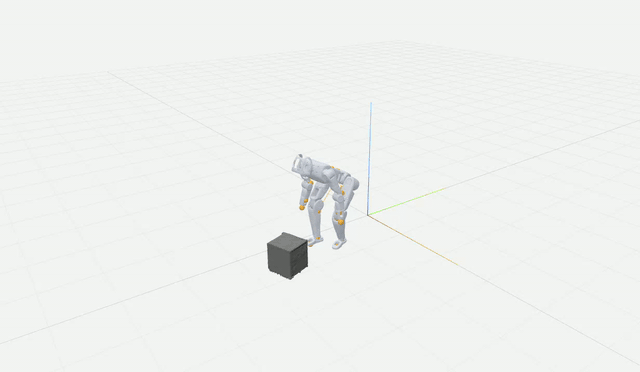
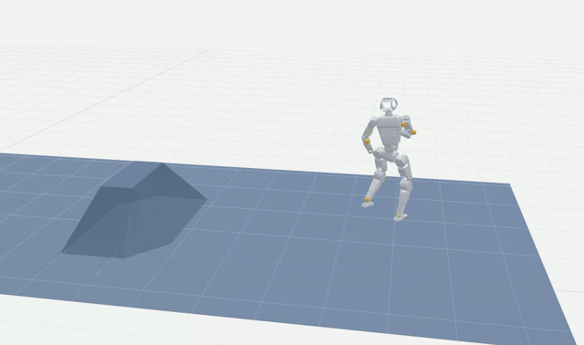

# human-humanoid-tools（hhtools）

**让人形机器人在约 30 秒内完成跑酷 / 跳舞 / 交互动作的重映射**

**[项目主页](https://jaggerShen.github.io/human-humanoid-tools/)** · **[English README](README.md)**

[](LICENSE)
[](https://www.python.org/downloads/)
[](https://github.com/jaggerShen/human-humanoid-tools)
[](https://jaggerShen.github.io/human-humanoid-tools/)

| | |
| :---: | :---: |
|  |  |
|  |  |

---

## 亮点

- **快速重映射**：拖入人体动作 → 选机器人 → 导出 CSV/ZIP；**Newton IK** + **MPC-SQP** 交互网格。
- **多源人体数据**：BVH / GLB / SMPL 系；适配 AMASS、GVHMR、LAFAN、OMOMO、PHUMA、intermimic、meshmimic 等。
- **任意 URDF**：Web 上传任意其他机器人。拖入 URDF，拖入 mesh，自动识别，无需调参。
- **机器人→机器人（R2R）**：已有机器人 CSV/PKL 轨迹重映射到新 URDF。
- **数据集分析**：Web 端扫描、打标、聚类、子集推荐。

**环境：** Linux，Python 3.12+；预览 CPU 即可，重映射需 **NVIDIA GPU（CUDA 12）**。

---

## 快速开始

```bash
git clone https://github.com/jaggerShen/human-humanoid-tools.git
cd human-humanoid-tools
curl -LsSf https://astral.sh/uv/install.sh | sh   # 若未安装
uv sync --extra all
uv run hhtools web
```

浏览器打开 `http://127.0.0.1:8009`。

| 面板 | 流程 |
|------|------|
| **Motion → Robot** | 加载动作 → 选机器人 → 标定（首次）→ Retarget → 下载 CSV/ZIP |
| **Robot → Robot** | 源机器人 + 轨迹 → 目标 URDF → 标定 → 单条/批量导出 |
| **数据集可视化分析** | 拖入文件夹 → 分析 → 标签/散点探索 → 导出子集 |

参数调优：改 [`configs/robots/unitree_g1/`](configs/robots/unitree_g1/) 或 `~/.config/hhtools/robots/<名称>/robot.yaml`，运行 `hhtools robot validate <名称>`。原理见 [framework.md](framework.md)。

### 调整 `robot.yaml`

路径：仓库内置机器人在 `configs/robots/<名称>/`；Web 上传的机器人在 `~/.config/hhtools/robots/<名称>/`。**改 yaml 后下次 Retarget 即生效，无需重启 Web**；仅升级 Python 包后需重启 `hhtools web`。

| 字段 | 作用 |
|------|------|
| `ik_map` | 标准人体关节 → URDF link。三自由度髋/肩应映射到**中间** link（多为 `*_roll_link`）。 |
| `weights` | IK 权重：`t_weight` 位置、`r_weight` 朝向。 |
| `smooth_joint_filter_masks` | 压低 gimbal 链上 pitch/yaw 等冗余自由度。 |
| `retarget.joint_scale_multipliers` | 各 canonical 关节的**绝对**缩放（与标定 `derived.scales` 同单位）。标定后会写入；可逐项微调体型，无需重新标定。例如 `left_shoulder: 0.5` 收窄上半身。**肩**只影响横向 IK 与 shoulder roll，不改变竖直身高；与标定值相同则视为未修改。 |
| `retarget.feet_stabilizer`、`apply_feet_stabilizer` | 脚底贴地、身体离地高度等；翻滚类动作可设 `apply_feet_stabilizer: false`。 |
| `retarget.references.<格式>` | 按动作格式覆盖（如 bundled `scaler_config`）。 |

```yaml
retarget:
  joint_scale_multipliers:
    left_shoulder: 0.5
    right_shoulder: 0.5
    left_elbow: 1.0
    # … 其余 ik_map 关节；与标定一致可省略
```

完整模板见 [`configs/robots/_template/robot.yaml`](configs/robots/_template/robot.yaml)。**重新上传 URDF** 会按 URDF 重新生成 `robot.yaml`（标定文件保留；手改的 `ik_map` / weights 可能被覆盖）。

**常见问题：** `git pull` 后请 `uv sync` 并重启 `uv run hhtools web`（勿用系统旧包）；硬刷新浏览器。Newton 批量失败会自动逐条回退；翻滚类动作请关闭「脚底贴地修正」。

---

## 演示动作（`assets/motions`）

仅含演示片段；完整数据请从上游下载。本工具只提供格式适配，**不重新分发**数据集。

| 模式 | 数据集 | 论文 | 下载 |
|------|--------|------|------|
| mimic | AMASS | [arXiv](https://arxiv.org/abs/1904.03278) | [官网](https://amass.is.tue.mpg.de/) |
| mimic | GVHMR | [arXiv](https://arxiv.org/abs/2409.06662) | [GitHub](https://github.com/zju3dv/GVHMR) |
| mimic | LAFAN1 | [arXiv](https://arxiv.org/abs/2102.04942) | [GitHub](https://github.com/ubisoft/ubisoft-laforge-animation-dataset) |
| mimic | Motion-X | [NeurIPS](https://proceedings.neurips.cc/paper_files/paper/2023/file/4f8e27f6036c1d8b4a66b5b3a947dd7b-Paper-Datasets_and_Benchmarks.pdf) | [GitHub](https://github.com/IDEA-Research/Motion-X) |
| mimic | PHUMA | [arXiv](https://arxiv.org/abs/2510.26236) | [GitHub](https://github.com/DAVIAN-Robotics/PHUMA) |
| mimic | SOMA | [arXiv](https://arxiv.org/abs/2603.16858) | [Hugging Face](https://huggingface.co/datasets/bones-studio/seed) |
| intermimic | OMOMO | [arXiv](https://arxiv.org/abs/2309.16237) | [Hugging Face](https://huggingface.co/datasets/YaojieShen/hhtools_omomo) |
| meshmimic | holosoma | [arXiv](https://arxiv.org/abs/2509.26633) | [GitHub](https://github.com/amazon-far/holosoma) |
| meshmimic | PARC MS | [arXiv](https://arxiv.org/abs/2505.04002) | [Hugging Face](https://huggingface.co/datasets/YaojieShen/hhtools_parc_ms) |

---

## 引用

若在论文或项目中使用 **human-humanoid-tools**，请引用本仓库：

```bibtex
@software{human_humanoid_tools2026,
  title        = {human-humanoid-tools (hhtools): humanoid motion retargeting and dataset analysis},
  author       = {jaggerShen and hhtools contributors},
  year         = {2026},
  url          = {https://github.com/jaggerShen/human-humanoid-tools},
  license      = {Apache-2.0}
}
```

**链接：** [GitHub 仓库](https://github.com/jaggerShen/human-humanoid-tools) · [Issues](https://github.com/jaggerShen/human-humanoid-tools/issues) · [LICENSE](LICENSE)

使用内置数据集适配器时，请同时引用对应 **上游数据集与算法**（见上表及 [NOTICE](NOTICE)，如 SOMA-Retargeter、holosoma）。

---

## 许可证

- **代码：** [Apache-2.0](LICENSE) · 第三方：[NOTICE](NOTICE)
- **SMPL 系权重：** 不随仓库分发，需自行从 MPI 下载并放入 `configs/body_models/` — 见 [configs/body_models/README.md](configs/body_models/README.md)
- **更多文档：** [framework.md](framework.md) · [CONTRIBUTING.md](CONTRIBUTING.md)
